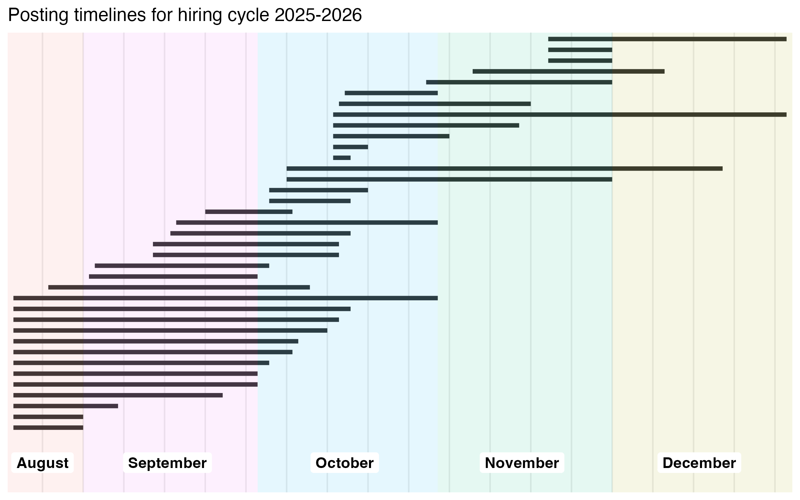

```{r}
#| echo: false
#| warning: false
# Install the core YAML parser if not installed

library(ggmap)
library(tidyverse, warn.conflicts = FALSE)
library(leaflet)

get_git_time <- function(fname) {
  system2("git", c("log", "--follow", "--diff-filter=A", "--pretty=%ct", "--date=short", "--", fname), stdout = TRUE) |>
    as.numeric() |>
    as.POSIXct(origin = "1970-01-01")
}

my_geocode <- function(location){
    geocodes <- read_csv("throughput/geocodes.csv")
    if (location %in% geocodes$location) {
        return(geocodes |> filter(location == !!location) |> select(lat, lon) |> slice(1) |> unlist())
    } else {
        result <- ggmap::geocode(location)
        result <- result |> mutate(location = location) |> 
            select(location, lat, lon)
        
        write.table(result, "throughput/geocodes.csv", row.names = FALSE, col.names = FALSE, append = TRUE, sep = ",")

        return(c(lat = result$lat, lon = result$lon))
    }
}

extract_qmd_yaml <- function(file_path) {
  # Read lines of the file
  lines <- readLines(file_path, warn = FALSE)
  
  # Find positions of the YAML delimiters (---)
  delimiters <- which(lines == "---")
  
  if (length(delimiters) >= 2) {
    # Isolate lines between the first two '---'
    yaml_lines <- lines[(delimiters[1] + 1):(delimiters[2] - 1)]
    yaml_text <- paste(yaml_lines, collapse = "\n")
    
    # Parse the text into an R list
    return(yaml::yaml.load(yaml_text))
  } else {
    stop("Could not find a valid YAML header in the file.")
  }
}

safe_convert_date <- function(x) {
  result <- safely(as.numeric, otherwise = NA_real_)(x)$result
  lubridate::as_datetime(result)
}

all_files <- list.files("jobs", full.names = TRUE)

# read in yaml metadata from all files and add the time 
# added to the git repository
df <- all_files |>
    map(safely(extract_qmd_yaml, otherwise = NULL)) |>
    map("result") |>
    bind_rows() |> 
    mutate(fname = all_files) |>
    mutate(time_added = map(fname, get_git_time)) |>
    mutate(time_added = safe_convert_date(time_added))

# deadline date formatting and logic
df <- df |>
    mutate(deadline = as.Date(deadline)) |> 
    mutate(year = lubridate::year(deadline)) |> 
    mutate(month = lubridate::month(deadline)) |>
    mutate(cycle_year = ifelse(month >= 7, year, year - 1))

# geocode the locations from the metadata
df <- df |>
  mutate(geocode = map(location, ~my_geocode(.x))) |> 
  mutate(lat = map_dbl(geocode, "lat"),
         lon = map_dbl(geocode, "lon")) |> 
         select(-geocode)
```

# Frequently Asked Questions

------------

#### ❓ Who maintains this site? 

The current lead maintainers of `cs-pui` are [Varsha Koushik](https://www.coloradocollege.edu/basics/contact/directory/people/koushik_varsha.html) (Colorado College), [Iris Howley](https://www.cs.williams.edu/~iris/) (Williams College) and [Phil Chodrow](https://www.philchodrow.prof/) (Middlebury College). The site was started in the 2020-21 hiring season by [Evan Peck](https://evanpeck.github.io/) (University of Colorado Boulder), who had previously tracked job posts via Twitter and a blog. [Anna Ritz](https://www.reed.edu/biology/ritz/) (Reed College) was another early primary maintainer of the site. Past and current contributors also include [John Rieffel](https://cs.union.edu/~rieffelj/) (Union College) and [Jordan Crouser](https://www.smith.edu/academics/faculty/jordan-crouser) (Smith College).

We are supported by a team of volunteers who help with curation, data collection, and other tasks.

------------

#### ❓ How much does it cost for departments to post? How do I post?

**Posting is free**. Please visit [our posting page](post-an-ad.qmd) for more information about listing your advertisement. 

------------

#### ❓ Does anyone look at it or use it? 

During the 2021-2022 CS hiring season, the website attracted ~10,000 visits. While it's hard to quantify the impact of those views, we received emails from people each year hearing that it made an impact on both (1) departmental applicant pools (and ultimately, hiring), and (2) candidate decision-making. 
 
We'd like to think that's pretty good impact-per-dollar-spent.

On a personal note, contributor [Phil Chodrow](www.philchodrow.prof) found his current job through this site! 

------------

#### ❓ When are ads typically posted? When are the deadlines?

The following plot shows the timeline of job postings for the previous hiring season. Each segment begins when the corresponding job is posted on this website and ends at the application deadline. 

```{r}
#| echo: false
#| message: false
#| warning: false
#| fig.width: 8
#| fig.height: 4


current_year <- lubridate::year(Sys.Date())
to_plot <- df |> 
    filter(cycle_year == current_year - 1) |> 
    mutate(date_added = lubridate::as_date(time_added)) |> 
    select(institution, date_added, deadline) |>
    filter(deadline > date_added) |> 
    arrange(date_added, deadline) |>
    mutate(institution = factor(institution, levels = unique(institution)))


# data frame of days in time period with their corresponding months
month_df <- data.frame(
    date = seq.Date(from = min(to_plot$date_added, na.rm = TRUE) - 1, 
                    to = max(to_plot$deadline, na.rm = TRUE) , 
                    by = "day")
) |>
    mutate(month = lubridate::floor_date(date, "month"),
    month_name = format(date, "%B")
    )


points <- month_df |> 
    group_by(month_name) |> 
    summarise(m = mean(date))


r <- to_plot |> 
    ggplot() + 
    geom_segment(aes(x = date_added, xend = deadline, y = institution, yend = institution), linewidth = 1.5, color = "#303030") + 
    theme_bw() + 
    scale_x_date(date_breaks = "1 weeks", expand = c(0, 0)) +
    theme(
        axis.text.y = element_blank(), 
        axis.title.y = element_blank(), 
        axis.ticks.y = element_blank(),
        panel.grid.major.y =  element_blank(), 
        panel.grid.minor.x = element_blank(),
        panel.border = element_blank(), 
        axis.text.x = element_blank(), 
        axis.ticks.x = element_blank(), 
        axis.title.x = element_blank()
        ) + 
    ggtitle(paste0("Posting timelines for hiring cycle ",  current_year - 1, "-", current_year)) + 
    geom_rect(data = month_df, aes(xmin = date, xmax = date + 1, ymin = -Inf, ymax = Inf, fill = factor(month_name)), inherit.aes = FALSE, alpha = 0.1) +
    scale_fill_discrete(name = "Month") + 
    geom_label(data = points, aes(x = m, y = -5, label = month_name), inherit.aes = FALSE, vjust = -1, fontface = "bold", border.colour = "white") + 
    guides(fill = "none") 

ggsave("fig/posting_timelines.png", plot = r, width = 8, height = 5)
```

<!-- ::: {.column-page} -->



<!-- ::: -->

Some nuance to the data: 

- Dates are based on when they appeared on this website and may not reflect the official date the ad was released. 
- Some institutions listed their deadlines as "rolling" and are not shown in this visualization. 
- This version of the site went live in the middle of August, so all postings that may have been present on previous versions of the site are listed as new postings on this version of the site as of the site going live. 
- While ads typically appear here pretty quickly, there is occasionally some lag, so it's better to look for general trends with this chart. 
- Some CS departments post 'ad forthcoming' here weeks before their official ad is live. 
- This chart is automated and the extraction of posting dates and deadlines may not have succeeded for every single posting. 

------------

#### ❓ Where are the jobs located?

The map below visualizes current (blue) and previous (grey) job  postings. The map is zoomable, and you can click on a listing for more information. 

::: {.column-page}

```{r}
#| echo: false
#| message: false
#| warning: false
#| fig.height: 8
# leaflet viz

current_year <- lubridate::year(Sys.Date())
df <- df |>
  mutate(color = ifelse(cycle_year == current_year, "#11369c", "darkgrey"))

df <- df |> 
  mutate(popup = paste0("<strong>", institution, "</strong><br/>", location, "<br/>Deadline: ", deadline, "<br/>", "<a href='", url, "'>", "Full posting", "</a>"))

# previous cycles for background 
prior <- df |> 
  filter(cycle_year < current_year) |> 
  mutate(lat = lat + runif(n(), -0.05, 0.05), 
         lon = lon + runif(n(), -0.05, 0.05))

current <- df |> 
  filter(cycle_year == current_year)

# make the viz!
leaflet(data = prior) |>
  addProviderTiles(providers$CartoDB.Positron) |>
  addCircleMarkers(~lon, ~lat , popup = ~popup, color = "black", radius = 5, stroke = TRUE, fillOpacity = 0.0, weight = 2) |>
  addCircleMarkers(data = current, ~lon, ~lat , popup = ~popup, color = "#11369c", clusterOptions = markerClusterOptions(), radius = 10, stroke = FALSE, fillOpacity = 0.8)
```

:::

*Exact locations have been jittered by up to 0.05 degrees latitude and longitude in order to facilitate visualization. These locations were extracted automatically from job postings using the Google Maps API and may be inaccurate.*

------------


#### ❓ Why focus the website on permanent/tenure-track positions - what about _teaching-track faculty_ or _fixed-term positions_? We need those too! 


We agree! Unfortunately, this site is curated on top of normal faculty duties, and without funding or compensation. As a result, we need to limit the scope to keep it manageable. We therefore prioritize and actively monitor tenure-track positions at institutions that are primarily undergraduate-focused (PUIs), while encouraging departments that match our scope to make their own submissions for visiting positions. 

Widening the site's scope isn't as simple as increasing the quantity of ads, but expands the months of the year we need to keep close attention on the market, and brings significant new challenges to curation (_e.g. does a visiting prof position at a liberal arts school practically have time for scholarship? How should we articulate the immense diversity of teaching-track positions, which can range from a reality that isn't too distant from adjuncting to institutions that offer tenure?_). All of this is time-intensive.

Until we can find resources for the site (if you have any leads, [let us know](mailto:evan.peck@colorado.edu))!, we have to keep the scope narrow. 

------------

#### ❓ How do I know whether my institution has enough emphasis on research? 


There really isn't a hard set of rules here. However, many schools on our list have: 

- _Reduced teaching load_ (in comparison to full-teaching colleges): The average teaching load is probably somewhere between a 2-2 or 3-2 (depending on how they define it). With only rare exceptions, 3-3 is a good guideline for an upper limit.  
- _Startup packages:_ While packages in PUIs are nowhere near those in R1s, most institutions offer funds to kick-start research.
- _Untenured leave:_ Most offer a pre-tenure leave of 1 or 2 semesters to help faculty invest in research 
- _Internal research resources:_ This often includes some travel support for conferences and significant internal support for summer undergraduate research. 

------------

#### ❓ Can I put my school on the list if we have some grad students?  


There is a lot of muddy ground here. In general, we don't include programs that graduate Ph.D. students. Most of the schools here either don't have Masters students _or_ graduate so few each year that they qualify as a liberal arts college. That being said, there are some schools on this list each year that are intensely undergraduate-focused even with larger Masters programs (and seem to have many other characteristics that look like a PUI). We're happy to include those institutions. 
  
